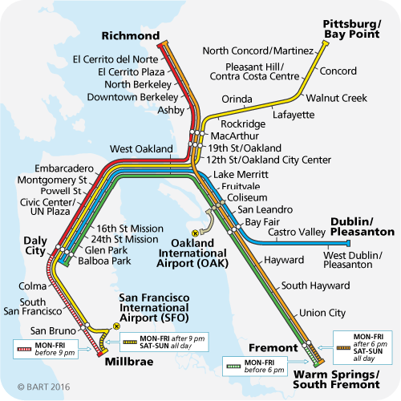

Bart Ridership Data
================
Nicholas Lai

Background
==========

The **Bay Area Rapid Transit** is the public train system that services the San Francisco Metropolitan Area, primarily connecting the Eastern Bay Area to San Francisco and the Caltrain system that services the Peninsula.

Location
========

*"A good traveler has no fixed plans, and is not intent on arriving" - Lao Tsu*

*"The only certain freedom's in departure" - Robert Frost*

The Bay Area has been the honoree and victim of many stereotypes bestowed upon the region by its observers. But the trouble about these stereotypes (and perhaps stereotypes in general) is that they are rife with contradictions. At once, the denizens of the Bay are both laid back (wearing a t-shirt and jeans to work, speaking in delightfully casual slang) and runners of an unending rat race (commuting long hours, stressing over housing expenses, seeking competitive tech jobs).

So, which is it? Are we Lao Tsu's good travelers and Frost's free departers, or are we too intent on arriving? Do more people use BART to commute to work, or for recreation?

First, let's observe the departure station data. This graph describes how many people got on a train from each station during 2016, and which stations they departed from. The larger and redder the station dot is, the more people departed from that station.

The most popular departure stations are in San Francisco, by large margins. Commuters seem to come from all over the Bay Area to work in SF, and go home back the way they came. Exact figures are on the table below.

| Station                           |  Number of Departures|
|:----------------------------------|---------------------:|
| Montgomery St.                    |            12,077,912|
| Embarcadero                       |            11,853,714|
| Powell St.                        |            10,799,056|
| Civic Center/UN Plaza             |             7,605,191|
| 24th St. Mission                  |             4,123,306|
| 16th St. Mission                  |             4,051,887|
| Downtown Berkeley                 |             4,012,680|
| 12th St. Oakland City Center      |             3,999,294|
| 19th St. Oakland                  |             3,891,536|
| Balboa Park                       |             3,609,841|
| Daly City                         |             2,910,199|
| MacArthur                         |             2,778,770|
| Fremont                           |             2,730,508|
| El Cerrito del Norte              |             2,603,966|
| Fruitvale                         |             2,603,745|
| Dublin/Pleasanton                 |             2,456,754|
| San Francisco Int'l Airport       |             2,440,116|
| Glen Park                         |             2,418,654|
| West Oakland                      |             2,374,564|
| Coliseum/Oakland Airport          |             2,333,954|
| Lake Merritt                      |             2,188,108|
| Pleasant Hill/Contra Costa Centre |             2,185,276|
| Millbrae                          |             2,110,147|
| Walnut Creek                      |             2,079,637|
| Pittsburg/Bay Point               |             1,861,283|
| Concord                           |             1,841,861|
| San Leandro                       |             1,835,988|
| Bay Fair                          |             1,816,462|
| Rockridge                         |             1,740,485|
| Ashby                             |             1,739,092|
| El Cerrito Plaza                  |             1,514,388|
| Hayward                           |             1,510,914|
| Union City                        |             1,439,433|
| North Berkeley                    |             1,424,084|
| Richmond                          |             1,350,273|
| Colma                             |             1,339,300|
| San Bruno                         |             1,156,346|
| South San Francisco               |             1,102,466|
| Lafayette                         |             1,090,124|
| West Dublin/Pleasanton            |             1,063,526|
| South Hayward                     |               934,910|
| Castro Valley                     |               911,709|
| Orinda                            |               895,245|
| North Concord/Martinez            |               833,626|
| Oakland Airport                   |               535,849|

Take a look at the other side of the coin: arrival data.

The map looks roughly similar to the departure data.

By far, the most popular BART stations are in San Francisco. The total arrival and departure graphs illustrate this point quite clearly, but they don't tell us whether or not most BART passengers commute from San Francisco to their jobs elsewhere in the Bay Area or to San Francisco from their homes in the suburbs.

To determine which pattern is more prevalent, we can stratify the data by AM/PM, with the idea that AM departures are stations near which commuters live, and PM departures are stations near which commuters work.

From these two graphs, we observe that AM departures are centered around San Francisco but PM departures are more evenly distributed throughout the Bay Area. This is evidence that more commuters live in San Francisco and commute to their jobs around the Bay Area, which may surprise many. Despite the density of technology companies and other employers in San Francisco, most commuters that use the BART use it to go to employers across the Bay Area.

A possible explanation for this phenomenon is BART stations in San Francisco being more accessible to larger numbers of people by walking distance. If BART stations aren't close enough to access easily, commuters may be inclined to take cars instead.

Although BART, as far as environmental impact, is preferable to putting thousands of cars on the road, it seems that BART is destined to be for the commuters. BART as of late has been pushing an initiative called "Bartable" that encourages riders to use BART for recreation instead of cars. Godspeed to them - if the data is anything to go by, they have a lot of ground to cover to encourage people to use BART for anything other than commuting.

Time
====

Up until now, we have assumed that most riders of the BART are commuters. Now we will justify this claim by illustrating BART usage data in a time series.

Below are four time series of San Francisco BART station departures in the month of August. We look at the month of August as it has no federal holidays.

San Francisco is both a commuter and recreational hub, so these four downtown stations are of interest to us.

Since people work during the weekdays and have the weekends off, we see the ratio of commuters to recreational users differ between BART departures on the weekdays and the weekends.

The weekday peaks and weekend troughs in the data above clearly show that commuters make up an outsize proportion of BART users.

Below is a yearly graph of Powell St. Station departures, which shows that the weekly usage cycle is consistent throughout the year.

Let's take a closer look at August:

August 1st, 2016 is a Monday, and the vertical axes denote successive Mondays. The data shows a clear drop in usage during the weekends of August. Clearly, recreational usage of BART is limited at best.

Pandering
---------

The Big Game, the rivalry football match between Stanford and Berkeley was played in Berkeley during November, but usage of the BART was not heightened on that day. However...

What happened on October 21, 2016?

Oakland Coliseum
----------------

Below is the yearly usage data for Coliseum station, home of the A's and the Raiders.

The peak usage of these stations is much more pronounced than that of the San Francisco stations. These peaks each coincide with A's and Raiders home games, which suggests that people use the BART to get to Coliseum games, unlike with Berkeley football games.

Here, we see the month of August's data. The peak represents the Raiders-Titans game that took place on August 27, 2016. We lost.

Conclusion
==========

BART, as a public transportation system, has done a good job fufilling one of its mandates: taking commuters to and from work. But, there is some evidence to suggest that people do not use BART to attend sporting events other than ones taking place at Oakland, where the Arenas are located walking distance away from the station. An expansion of this project to look at other events, such as concerts and rallies, is necessary to generalize this to a problem about BART ridership to recreational events in general, but based on the data presented above, the barriers to attending sporting events using BART are too high to get vehicles off the road and reduce congestion and gas emissions resulting from them.

Sources
=======

<https://www.kaggle.com/jonathanbouchet/bart-transit-system>

<https://www.rstudio.com/wp-content/uploads/2015/03/ggplot2-cheatsheet.pdf> - ggplot2 Cheat Sheet

<https://www.kaggle.com/saulfuh/bart-ridership/data> - The raw dataset

<https://cran.r-project.org/web/packages/viridis/vignettes/intro-to-viridis.html> - viridis colorblind gradient

<https://www.rdocumentation.org/packages/lubridate/versions/1.7.4> - lubridate documentation

<https://cran.r-project.org/web/packages/ggthemes/vignettes/ggthemes.html> - ggthemes list

<https://www.rdocumentation.org/packages/knitr/versions/1.19/topics/kable> - kable documentation
